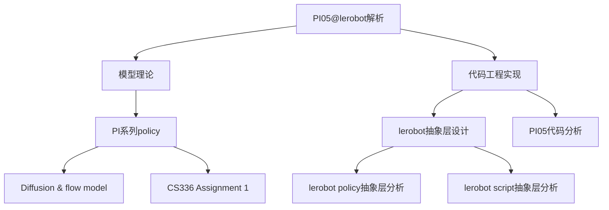

> [!NOTE] 注意
> 本笔记是针对 OpenPI 实验室的 PI 系列建模进行分析的一部分，主要负责对 [Lerobot](https://github.com/huggingface/lerobot) 的 Policy 类进行分析，更偏重代码层面。
> 本文档基于Lerobot 0.5.0 版本（2026.3）进行分析，请注意是否过时。
> 理论层面可以查看[[PI 系列 Policy]]、[[Diffusion & Flow model]]、[[CS336 Assignment 1]]


## 0. 总论：LeRobot Policy 抽象层的设计思路

LeRobot 支持多种截然不同的策略架构——ACT、Diffusion Policy、π0/π0.5 等——但训练脚本和评估脚本只需各写一份。这背后的核心设计就是 **抽象层**：用统一的接口屏蔽不同策略的实现细节，让上层代码面向"抽象的 Policy"编程，而非面向"具体的 π0.5"编程。

### 核心双类结构
LeRobot 的 Policy 系统围绕两个基类构建：

|基类|位置|职责|
|---|---|---|
|`PreTrainedConfig`|`lerobot.configs.policies`|**描述策略"是什么"**：超参数、特征定义、优化器预设、归一化方式|
|`PreTrainedPolicy`|`lerobot.policies.pretrained`|**描述策略"做什么"**：前向传播、损失计算、动作推理、权重存取|
两者的关系是：**Config 先行，Policy 依赖 Config**。每个 Policy 实例在构造时必须传入一个匹配的 Config 对象，Config 决定了网络的形状和训练的行为，Policy 基于这些配置构建实际的神经网络并执行计算。

```
Config (数据容器，纯描述)
  │
  │  决定了
  ▼
Policy (nn.Module，实际计算)
  │
  │  被调用于
  ▼
训练脚本 / 评估脚本 (只依赖抽象接口)
```

### 关键 OOP 设计手法
这两个基类综合运用了以下设计模式，形成了 LeRobot 抽象层的骨架：
- **抽象基类（ABC）**：`PreTrainedConfig` 和 `PreTrainedPolicy` 都继承了 `abc.ABC`，通过 `@abc.abstractmethod` 强制子类实现特定方法（如 `forward`、`select_action`、`validate_features`）。任何子类遗漏了这些方法都无法实例化，从而在开发阶段就暴露错误。
- **Mixin 多继承**：`PreTrainedPolicy` 同时继承 `nn.Module`（PyTorch 参数管理）、`HubMixin`（HuggingFace Hub 读写）和 `abc.ABC`（抽象约束），将三种独立能力拼装到同一个类上。
- **Config/Model 分离**：配置可以独立序列化为 `config.json`、独立传输和复用，不依赖模型实例的存在。这也是 HuggingFace Transformers 库的核心设计惯例。
- **工厂方法**：`from_pretrained` 作为 `@classmethod`，将"构造对象 → 下载权重 → 加载权重 → 设为 eval 模式"打包为一步操作。
- **`__init_subclass__` 检查**：在子类**定义时**（而非实例化时）就检查是否声明了 `config_class` 和 `name` 属性，相当于类属性级别的 `@abc.abstractmethod`。

## 1. 配置类 (`MyPolicyConfig`)

这个类定义了你的策略所需的超参数和配置。它必须继承自 `PreTrainedConfig`。LeRobot 使用 `draccus` 进行配置管理，这使得可以从命令行参数进行类型安全的解析。

### 位置
通常放置在 `lerobot/policies/<policy_name>/configuration_<policy_name>.py`。

### 必要的继承
```python
from lerobot.configs.policies import PreTrainedConfig
from dataclasses import dataclass

@dataclass
class MyPolicyConfig(PreTrainedConfig):
    ...
```
### 类属性
在抽象基类中定义的几个属性，主要是关于模型的元信息，选取几个作为例子：
```Python
@dataclass
class PreTrainedConfig(draccus.ChoiceRegistry, HubMixin, abc.ABC):
    n_obs_steps: int = 1
    input_features: dict[str, PolicyFeature] | None = field(default_factory=dict)
    output_features: dict[str, PolicyFeature] | None = field(default_factory=dict)
    device: str | None = None  # e.g. "cuda", "cuda:0", "cpu", or "mps"
    # Add tags to your policy on the hub.
    license: str | None = None
    pretrained_path: Path | None = None
```
大部分都是可选的，子类也可以自行创建。

这些 property 从 `input_features` / `output_features` 中按类型过滤，方便子类和训练代码快速获取：

| 属性                  | 作用                           |
| --------------------- | ------------------------------ |
| `robot_state_feature` | 提取机器人本体状态（关节角等） |
| `image_features`      | 提取所有视觉输入               |
| `action_feature`      | 提取动作输出特征               |
| `env_state_feature`   | 提取环境状态（如果有）         |

### 必须实现的抽象方法与属性
你必须实现以下方法以满足 `PreTrainedConfig` 抽象类的要求：

1.  **`observation_delta_indices`** (属性):
    -   返回观测特征中代表增量 (delta) 而非绝对值的索引列表（通常用于归一化目的）。如果不适用，则返回 `None`。
    -   签名: `@property def observation_delta_indices(self) -> list | None:`

2.  **`action_delta_indices`** (属性):
    -   返回动作空间中是增量的索引或键的列表。如果不适用，则返回 `None`。
    -   签名: `@property def action_delta_indices(self) -> list | None:`

3.  **`reward_delta_indices`** (属性):
    -   同上，但是针对奖励 (reward)。如果不适用，则返回 `None`。
    -   签名: `@property def reward_delta_indices(self) -> list | None:`

4.  **`validate_features`**:
    -   用于验证配置中的输入/输出特征是否符合策略预期的方法。如果验证失败，应抛出错误。
    -   签名: `def validate_features(self) -> None:`

5.  **`get_optimizer_preset`**:
    -   返回默认的优化器配置（例如，带有特定学习率的 AdamW）。
    -   签名: `def get_optimizer_preset(self) -> OptimizerConfig:`

6.  **`get_scheduler_preset`**:
    -   返回默认的学习率调度器配置。如果默认不使用调度器，则返回 `None`。
    -   签名: `def get_scheduler_preset(self) -> LRSchedulerConfig | None:`


这意味着每个具体策略（ACT、Diffusion、VLA）都要声明自己需要什么样的优化配置和归一化方式。

几个带有delta的函数是**"差分归一化"**——指定哪些维度在归一化时用**相邻帧的差值**而不是绝对值。

举个例子，假设动作是 `[x, y, z, gripper]` 共 4 维：

- `action_delta_indices = [0, 1, 2]` 表示 x/y/z 位置维度要做差分（`a_t - a_{t-1}`），转化为类似速度的量再归一化
- `gripper`（第3维）不在列表里，因为它是开合状态（0/1），差分没意义

为什么要这样做？因为**绝对位置**的分布范围可能很大且依赖初始位置，差分后数据分布更稳定，归一化效果更好。返回 `None` 表示该策略不用差分归一化。


而优化器/调度器预设是因为不同策略的训练超参差异很大：

- **ACT**：用 AdamW，lr=1e-5，较小的 weight_decay
- **Diffusion Policy**：lr 可能 1e-4，配合 cosine scheduler
- **VLA 微调**：可能冻结 backbone，只有 action head 用较大 lr

把这些 "推荐配置" 封装在 config 里，训练循环不需要针对每种策略写不同的优化器代码，直接调用即可。


最后一个函数在构建策略前检查 `input_features` / `output_features` 的配置是否合法。比如：

- ACT 要求必须有且仅有一个 `ACTION` 类型的输出
- 某些策略要求图像输入必须是特定分辨率
- SmolVLA 可能要求必须有至少一个视觉输入

如果配置不合法就直接报错，**fail fast**，避免跑到训练中途才崩。


### 隐式要求
-   你的类名应该通过继承 `PreTrainedConfig` 自动注册到 `draccus`。`type` 属性会根据类名或注册键自动处理，但你应该确保命名唯一。

### 装饰器
本库中大量运用到了 Python 的装饰器这一语法糖，包括：
- `@property` 将一个类函数转为类属性，即把一个本来要调用函数改为调用类属性，但是同时仍然会进行函数运算。可以做到动态生成；写入时可以进行校验和拦截；支持只读保护；可以控制删除：
- `@dataclass`装饰器的核心作用就是**自动生成样板代码**，减少一堆重复的 `__init__`、`__repr__` 等方法。
- ` @abc.abstractmethod`的作用是**强制子类必须实现某个方法**，否则子类无法被实例化。它是定义"接口契约"的机制。

---

## 2. 策略类 (`MyPolicy`)

这个类包含模型架构以及前向传播、损失计算和动作推理的逻辑。它必须继承自 `PreTrainedPolicy`。

### 位置
通常放置在 `lerobot/policies/<policy_name>/modeling_<policy_name>.py`。

### 必要的继承
```python
from lerobot.policies.pretrained import PreTrainedPolicy
from torch import Tensor, nn

class MyPolicy(PreTrainedPolicy):
    ...
```
`PreTrainedPolicy`是继承自`nn.Module`、`HubMixin`、`abc.ABC`，使得其首先是个抽象基类，其次具备了`nn.Module`的性质，包括优化器，反向求导和进行推理的函数，以及可以从 huggingface 数据格式中读取权重的能力。

### 必要的类属性
1.  **`config_class`**:
    -   必须指向你的配置类（例如 `MyPolicyConfig`）。
    -   `config_class = MyPolicyConfig`
2.  **`name`**:
    -   你的策略的字符串标识符（例如 "my_policy"）。
    -   `name = "my_policy"`

### 必须实现的抽象方法
你必须实现以下方法以满足 `PreTrainedPolicy` 抽象类的要求：

1.  **`__init__`**:
    -   使用提供的 `config` 初始化模型组件（backbones, heads 等）。
    -   调用 `super().__init__(config)`。

2.  **`reset`**:
    -   当环境重置时调用，用于重置内部状态（例如，对于循环策略或动作分块队列）。
    -   签名: `def reset(self):`

3.  **`get_optim_params`**:
    -   返回一个传递给优化器的参数字典或列表。这允许设置不同的学习率（例如，backbone 和 head 使用不同的学习率）。
    -   签名: `def get_optim_params(self) -> dict:`

4.  **`forward`**:
    -   主要的训练步骤。接收一批数据，计算模型输出，并计算损失。
    -   **输入**: `batch` (Tensor 字典)。
    -   **返回**: 一个元组 `(loss, output_dict)`。`loss` 必须是用于反向传播的标量 Tensor。`output_dict` 包含用于记录日志的指标。
    -   签名: `def forward(self, batch: dict[str, Tensor]) -> tuple[Tensor, dict]:`

5.  **`predict_action_chunk`**:
    -   给定一批观测值，预测一系列（分块/chunk）动作。理想情况下在 `eval` 模式下运行。
    -   **输入**: `batch` (Tensor 字典)。
    -   **返回**: 形状为 `(batch_size, chunk_size, action_dim)` 的 Tensor。
    -   签名: `def predict_action_chunk(self, batch: dict[str, Tensor]) -> Tensor:`

6.  **`select_action`**:
    -   返回一个要在环境中执行的单一动作。此方法通常处理诸如 **时间集成 (temporal ensembling)** 或 **动作队列 (action queueing)** 的逻辑（如果模型预测分块）。
    -   **输入**: `batch` (Tensor 字典)。
    -   **返回**: 代表单一动作的 Tensor。
    -   签名: `def select_action(self, batch: dict[str, Tensor]) -> Tensor:`

---

### 代码骨架

```python
class PreTrainedPolicy(nn.Module, HubMixin, abc.ABC):
    """
    Base class for policy models.
    """

    config_class: None
    name: None

    def __init__(self, config: PreTrainedConfig, *inputs, **kwargs):
        super().__init__()
        self.config = config

    def __init_subclass__(cls, **kwargs):
        super().__init_subclass__(**kwargs)

    def _save_pretrained(self, save_directory: Path) -> None:
        self.config._save_pretrained(save_directory)
        model_to_save = self.module if hasattr(self, "module") else self
        save_model_as_safetensor(model_to_save, str(save_directory / SAFETENSORS_SINGLE_FILE))

    @classmethod
    def from_pretrained(
        cls: builtins.type[T],
        pretrained_name_or_path: str | Path,
        *,
        config: PreTrainedConfig | None = None,
        force_download: bool = False,
        resume_download: bool | None = None,
        proxies: dict | None = None,
        token: str | bool | None = None,
        cache_dir: str | Path | None = None,
        local_files_only: bool = False,
        revision: str | None = None,
        strict: bool = False,
        **kwargs,
    ) -> T:
        """
        The policy is set in evaluation mode by default using `policy.eval()` (dropout modules are
        deactivated). To train it, you should first set it back in training mode with `policy.train()`.
        """
        policy.to(config.device)
        policy.eval()
        return policy

    @classmethod
    def _load_as_safetensor(cls, model: T, model_file: str, map_location: str, strict: bool) -> T:
        return model

    @abc.abstractmethod
    def get_optim_params(self) -> dict:
        """
        Returns the policy-specific parameters dict to be passed on to the optimizer.
        """
        raise NotImplementedError

    @abc.abstractmethod
    def reset(self):
        """To be called whenever the environment is reset.

        Does things like clearing caches.
        """
        raise NotImplementedError

    # TODO(aliberts, rcadene): split into 'forward' and 'compute_loss'?
    @abc.abstractmethod
    def forward(self, batch: dict[str, Tensor]) -> tuple[Tensor, dict | None]:
        """_summary_

        Args:
            batch (dict[str, Tensor]): _description_

        Returns:
            tuple[Tensor, dict | None]: The loss and potentially other information. Apart from the loss which
                is a Tensor, all other items should be logging-friendly, native Python types.
        """
        raise NotImplementedError

    @abc.abstractmethod
    def predict_action_chunk(self, batch: dict[str, Tensor], **kwargs: Unpack[ActionSelectKwargs]) -> Tensor:
        """Returns the action chunk (for action chunking policies) for a given observation, potentially in batch mode.

        Child classes using action chunking should use this method within `select_action` to form the action chunk
        cached for selection.
        """
        raise NotImplementedError

    @abc.abstractmethod
    def select_action(self, batch: dict[str, Tensor], **kwargs: Unpack[ActionSelectKwargs]) -> Tensor:
        """Return one action to run in the environment (potentially in batch mode).

        When the model uses a history of observations, or outputs a sequence of actions, this method deals
        with caching.
        """
        raise NotImplementedError

```

此代码来自policies文件夹中的`pretrained.py`这个文件，省略了大量检测错误代码。主要是一个抽象基类，规定了policy需要有什么基本函数。其中最重要的

| 方法                                     | 作用                                                         |
| ---------------------------------------- | ------------------------------------------------------------ |
| `forward(batch)` → `(loss, info)`        | 训练时的前向传播，返回 loss                                  |
| `select_action(batch)` → `Tensor`        | **推理核心**：给定观测，返回单步动作，负责处理历史缓存和 action chunking 的调度 |
| `predict_action_chunk(batch)` → `Tensor` | 预测一个动作块（action chunk），被 `select_action` 内部调用  |
| `reset()`                                | 环境 reset 时清空缓存（如 action chunk 队列、观测历史等）    |
| `get_optim_params()`                     | 返回优化器参数组（允许不同模块用不同 lr）                    |

`select_action` 和 `predict_action_chunk` 的分离设计是关键——`predict_action_chunk` 负责模型推理出一整段动作序列，`select_action` 负责从缓存中逐步取出单步动作，实现了 **action chunking** 的统一抽象。

这个文件主要负责实现读取和缓存，创建一个实例的函数。因为 Policy 的骨干完全没有填充，以下讲解一下我觉得比较值得注意一些函数。

`from_pretrained`是一个**工厂函数**，它是一个类函数，因为有时候"创建一个可用对象"需要好几步——先读 config、再构造网络、再下载权重、再加载权重、再设成 eval 模式。如果让用户自己写这五步，容易出错。所以框架提供一个 `classmethod`，把这些步骤打包成"一步到位"的工厂方法。

同时在`__init_subclass__()`会检验子类的属性是否具有`config_class`和`name`这类属性，没有则直接退出，预防 bug 的出现。这个相当于类属性的`@abc.abstractmethod`。

### Peft

Peft 是Parameter-Efficient Fine-Tuning，比如 Lora 等轻量微调。这个文件直接完成了返回由第三方库`peft`包装的模型。不过需要训练时提供 peft 的 config，否则从默认值开始构建。

流程为：
  1. 确定最终配置：
    - 若传入了 peft_config，直接用（可再叠加 CLI overrides）
    - 否则调用 _build_peft_config 从默认值 + CLI overrides 构建
  2. 调用 _validate_peft_config 验证配置合法性
  3. 冻结所有基础参数：p.requires_grad_(False)，只训练 adapter 参数
  4. 若有 pretrained_path，赋给 self.name_or_path（供 PEFT 内部使用）
  5. 调用 get_peft_model(self, final_config) 包裹模型
  6. 标记 config.use_peft = True，供后续加载时识别

代码依赖为：
```
  wrap_with_peft
  ├── 有 peft_config → _apply_peft_cli_overrides → _preprocess_peft_cli_overrides
  └── 无 peft_config → _build_peft_config → _preprocess_peft_cli_overrides
                                          → _get_default_peft_targets (子类实现)
           ↓
      _validate_peft_config (子类可重写)
           ↓
      get_peft_model (peft 库)
```