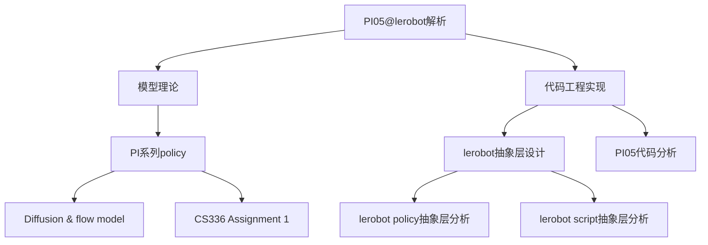

> [!NOTE] 注意
> 本笔记是针对 OpenPI 实验室的 PI 系列建模进行分析的一部分，主要负责对 PI05 的 lerobot 实现进行分析，更偏重代码层面。选用 lerobot 而非官方实现的原因是官方使用的是 JAX 框架而非 torch，有迁移困难。
> 本文档基于Lerobot 0.5.0 版本（2026.3）进行分析，请注意是否过时。
> 理论层面可以查看[[PI 系列 Policy]]、[[Diffusion & Flow model]]、[[CS336 Assignment 1]]

`PI05`的建模采用了三层抽象层的设计，包括`PI05Policy`,`PI05Pytorch`,`PaliGemmaWithExpertModel`这三个逐级抽象的类设计。
```
  PI05Policy          ← LeRobot 接口层（处理 batch、评估、训练）
      └── PI05Pytorch     ← 扩散模型核心（flow matching 前向/采样逻辑）
              └── PaliGemmaWithExpertModel  ← 双流 Transformer 融合层
                      ├── paligemma (VLM)       ← 处理图像 + 语言 tokens（prefix）
                      └── gemma_expert          ← 处理动作 tokens（suffix）
```
