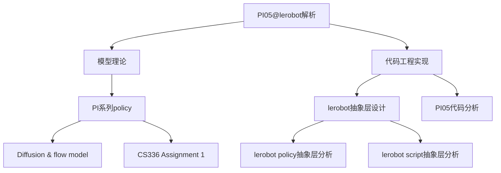

s> [!NOTE] 注意
> 本笔记是针对 OpenPI 实验室的 PI 系列建模进行分析的一部分，主要负责对 PI05 的 lerobot 实现进行分析，更偏重代码层面。选用 lerobot 而非官方实现的原因是官方使用的是 JAX 框架而非 torch，有迁移困难。
> 本文档基于Lerobot 0.5.0 版本（2026.3）进行分析，请注意是否过时。
> 理论层面可以查看[[PI 系列 Policy]]、[[Diffusion & Flow model]]、[[CS336 Assignment 1]]

## 总览
`PI05`的建模采用了三层抽象层的设计，包括`PI05Policy`,`PI05Pytorch`,`PaliGemmaWithExpertModel`这三个逐级抽象的类设计。
```
  PI05Policy          ← LeRobot 接口层（处理 batch、评估、训练）
      └── PI05Pytorch     ← 扩散模型核心（flow matching 前向/采样逻辑）
              └── PaliGemmaWithExpertModel  ← 双流 Transformer 融合层
                      ├── paligemma (VLM)       ← 处理图像 + 语言 tokens（prefix）
                      └── gemma_expert          ← 处理动作 tokens（suffix）
```
在内部的信息大部分是以字典的形式储存，即以键值对的形式储存包括视频 RGB 图像，关节状态等数据。

## `PaliGemmaWithExpertModel`

### 数据类型
在`to_bfloat16_for_selected_params(l.398)`建立了一个混合精度格局：
```
整体 → bfloat16
然后以下路径保持 float32:
  - vision_tower               (SigLIP 视觉编码器)
  - multi_modal_projector      (视觉→语言维度投影)
  - input_layernorm            (所有层的输入 LayerNorm)
  - post_attention_layernorm   (所有层的 post-attention LayerNorm)
  - model.norm                 (最终 norm)
```
这个设计的动机注释：toggle causes optimizer "same dtype"  error，即混合精度训练时 LayerNorm 参数如果是 bfloat16，优化器在 dtype 转换时会报错。LayerNorm  保持 float32 也有数值稳定性考量。

| 参数类型                   | dtype    | 原因                   |
| :------------------------- | :------- | :--------------------- |
| 视觉编码器 + 投影层        | float32  | 精度敏感，避免梯度消失 |
| LayerNorm (输入/输出/最终) | float32  | 优化器兼容 + 数值稳定  |
| attention QKV/O proj + MLP | bfloat16 | 节省显存               |
该类在定义`to_bfloat16_for_selected_params()`的同时，在模型初始化的时候就定义好所有**参数**的数据类型，只需定义一次。但是传入的数据类型需要进行转换：

其中真正为了和参数匹配的转换只有三处： 
1. 第三次（进 transformer 前，embedding → bfloat16 匹配 attention 权重） 
2. 第五/六次（transformer 内部，匹配 o_proj 和 MLP 权重） 
3. 第七次（出 transformer 后，匹配 action_out_proj 和 loss 计算）

其余转换多是为了数值精读或防御性设计。

### Mask设计
本模型带有三种 Mask 的定义：
- `pad_masks bool[B,N]`：哪些位置是真实 token
- `att_masks float[B,N]`：每个token的“组边界”标记
- `att_2d_masks bool[B,N,N]`：token i 能否看到 token j

## Transformer和流匹配


## `PI05Pytorch`

### Prefix & Suffix
在[[PI 系列 Policy]]中可以看到 PI05 是分为 VLM 和 Action Expert 两部分，以一个类似 MoE的方式处理不同类型的数据来源，对于视觉数据和语言，输入 VLM，对于动作状态，输入流匹配网络，并且流匹配模型可以看到 VLM 中的状态，其中输入 VLM 网络的就算做 prefix，而输入动作专家网络的就算 Suffix。
`embed_prefix(self, images, img_masks, tokens, masks)`：

| 参数          | 形状                   | 含义                                       |
| :---------- | :------------------- | :--------------------------------------- |
| `images`    | `List[[B, C, H, W]]` | 每个摄像头一个 tensor，由 `_preprocess_images` 准备 |
| `img_masks` | `List[[B]]`          | 每个摄像头对应一个 bool 掩码，`True` 表示该样本这个摄像头有图像   |
| `tokens`    | `[B, L]`             | 语言 token 的整数索引（由 tokenizer 生成）           |
| `masks`     | `[B, L]`             | 语言 token 的 padding mask，`True` 为真实 token |
```Python
    def embed_prefix(
        self, images, img_masks, tokens, masks
    ) -> tuple[torch.Tensor, torch.Tensor, torch.Tensor]:
        """Embed images with SigLIP and language tokens with embedding layer."""
        embs = []
        pad_masks = []
        att_masks = []

        # Process images
        for img, img_mask in zip(images, img_masks, strict=True):

            def image_embed_func(img):
                return self.paligemma_with_expert.embed_image(img)

            img_emb = self._apply_checkpoint(image_embed_func, img)
            bsize, num_img_embs = img_emb.shape[:2]

            embs.append(img_emb)
            pad_masks.append(img_mask[:, None].expand(bsize, num_img_embs))
            att_masks += [0] * num_img_embs

        # Process language tokens
        def lang_embed_func(tokens):
            lang_emb = self.paligemma_with_expert.embed_language_tokens(tokens)
            lang_emb_dim = lang_emb.shape[-1]
            return lang_emb * math.sqrt(lang_emb_dim)

        lang_emb = self._apply_checkpoint(lang_embed_func, tokens)
        embs.append(lang_emb)
        pad_masks.append(masks)

        num_lang_embs = lang_emb.shape[1]
        att_masks += [0] * num_lang_embs

        embs = torch.cat(embs, dim=1)
        pad_masks = torch.cat(pad_masks, dim=1)
        att_masks = torch.tensor(att_masks, dtype=torch.bool, device=pad_masks.device)

        bsize = pad_masks.shape[0]
        att_masks = att_masks[None, :].expand(bsize, len(att_masks))

        return embs, pad_masks, att_masks

```
prefix 是处理图像和语言的输入，需要将其 embed 到向量格式，包括`embs`,`pad_masks`,`att_masks`三个向量，即经过 embed 过的图片张量，padding mask 和 attentionmask：
- `embs`储存真实的图片信息，以`[B,C,H,W]`储存，即`batch_size`,`Channel`,`Height`,`Width`储存
- `pad_mask`是用于表述一个