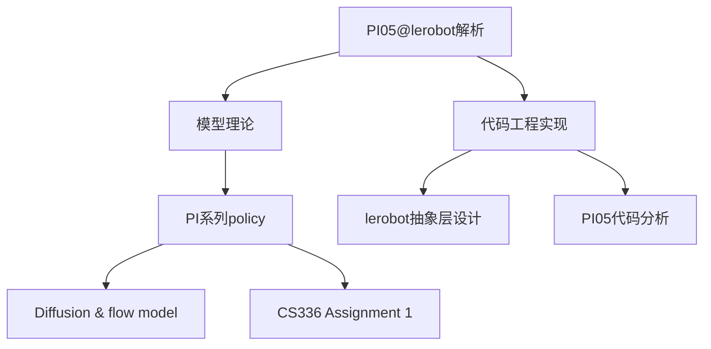

> [!NOTE] 注意
> 本笔记是针对 OpenPI 实验室的 PI 系列建模进行分析，更偏重理论层面，由于PI系列是基于 VLA 的模型，所以需要 Transformers [[CS336 Assignment 1]] 基础和 Flow model [[Diffusion & Flow model]] 才能看懂。
> 至于代码实现，可以查看[[PI05代码分析]] 和 [[Lerobot Policy抽象基类]]

> [!NOTE] 注意
> 本文主要聚焦PI系列策略的建模，所以不会特别提及模型的训练方式和训练集，尽管这两个方向可以说和建模同等重要，这部分可以查看[[pi0.5]]，虽然这部分因为是早期文章所以稍显稚嫩，可能考虑重构一下。
## PI0
整体来说，PI 系列的强大性能并不是源自其颠覆性的模型架构，而是来自优秀的能有效利用大量数据的模型架构、大量优质数据和广泛分布的数据、大量算力的结果，这也符合 Dario 的「Big Blob of Compute Hypothesis」。
### PI0 模型架构
当然，对这个模型本身的提升也是不容忽视，它在文中直接提到了模型架构的启发者：[Transfusion](https://arxiv.org/abs/2408.11039) 这个多模态模型。具体来说，PI0 采用了将图像和关节状态通过一个线性投影层 embed 到和语言 token 一样的 embedding space 中，然后使用了 Flow matching 的模型来实现对连续动作空间的建模。这两点都是直接从 Transfusion 中跨领域获取的知识。

同时，论文发现把动作状态和画面语言使用不同的权重可以带来性能上的提升，类似一种 MoE 思想，但是是硬编码了不同类型数据走不同通道。对于不同数据，采用不同的 attention 权重和不同的 FFN 权重，可以说是使用了两个模型，但是 action 部分能单向 attention 到视觉语言部分的权重。
如图，改模型使用两到三路 ViT SigLIP 来接收三个摄像头的画面并将其 embed 到统一的 embedding space 中，同时和语言指令一起拼接输入 PaliGemma 模型，以及有一个 action expert 同时处理机器状态 $q_t$。
在 Transformer 内部是两个模型并行处理不同的数据，即在每一层 Transformer 中：
第一步：各 expert 独立计算 Q、K、V
```
VLM expert:     [img tokens, lang tokens] → 用 VLM 的 Q,K,V 权重 → Q_vlm, K_vlm, V_vlm
Action expert:  [proprio tokens, action tokens] → 用 Action 的 Q,K,V 权重 → Q_act, K_act, V_act
```
第二步：K、V 拼接成全局 KV，做 cross-expert attention
```
Global K = concat(K_vlm, K_act)
Global V = concat(V_vlm, V_act)

VLM tokens:    Q_vlm    × Global K/V → attention output (受 block mask 限制只看 VLM 自己)
Action tokens: Q_act    × Global K/V → attention output (可以看到所有 token)
```
这里的 Cross attention 就像原始 Transformer 中用 encoder 的 Q 和 decoder 的 KV 进行 attention，但是这里是 cross-expert，即是使用全局的 KV 来和 action expert 部分的 Q 进行 attention，此处由于 VLM 部分是被 mask 看不到动作部分的信息，所以和只和自己做 attention 没区别。

第三步：各自过自己的 FFN
```
VLM attention output    → VLM FFN
Action attention output → Action Expert FFN
```

因为一次推理的时候所有 token 都保持不变，但是 flow model 需要10步采样，所以还可以用 KVCache 来优化。

### PI0 训练与推理
来到公式部分，模型理论上想要求一个数据分布 $p(\mathbf{A}_t|\mathbf{o}_t)$ 其中 $\mathbf{A}_t=[a_t,a_{t+1},\cdots,a_{t+H-1}]$ 来代表要求的一个 action chunk，$\mathbf{o}_t=[\mathbf{I}_t^1,\cdots,\mathbf{I}_t^n,\ell_t,\mathbf{q}_t]$ ，其中 $\mathbf{I}_t^i$ 是第 $i$ 个图像，$\ell_t$ 是一串字符 tokens，$\mathbf{q}_t$ 是关节角度的向量。也就是说 PI0 是个纯依赖当前状态的马尔可夫决策过程，虽然输出的 action chunking 本身隐含部分时序结构，但是在长程任务上还是性能较弱。然后模型通过求 flow matching loss 来优化：
$$
L^\tau(\theta) = \mathbb{E}_{p(\mathbf{A}_t | \mathbf{o}_t),\; q(\mathbf{A}_t^\tau | \mathbf{A}_t)} \left\| \mathbf{v}_\theta(\mathbf{A}_t^\tau, \mathbf{o}_t) - \mathbf{u}(\mathbf{A}_t^\tau | \mathbf{A}_t) \right\|^2
$$
其中：
- $\theta$: 模型的可学习参数；
- $\tau$: flow matching 中的"时间", $\tau \in [0, 1]$，1 表示干净数据，0 表示纯噪声（注意这里用 $\tau$ 而不是 $t$，因为 $t$ 已经被用来表示机器人的物理时间步了）；
- $\mathbf{o}_t$: 时间步 $t$ 的观测，包括图像 $\mathbf{I}_t$、语言指令 $\ell_t$、关节角度 $\mathbf{q}_t$ ； 
- $\mathbf{A}_t = [\mathbf{a}_t, \mathbf{a}_{t+1}, \ldots, \mathbf{a}_{t+H-1}]$: 从时间步 $t$ 开始的 action chunk，即未来 $H = 50$ 步的动作序列，这是 ground truth；  
- $\mathbf{A}_t^\tau$: 把干净的 action chunk $\mathbf{A}_t$ 沿 flow matching 路径加噪到"时刻 $\tau$"的结果，即 $A_t^\tau = \tau A_t + (1-\tau)\epsilon$，其中 $\boldsymbol{\epsilon}$ 是高斯噪声，也就是 0 时刻的纯噪音选用的是高斯噪音。

> [!NOTE] 注意
> PI0 的 Flow matching 采用 1 时刻表示干净数据，0 时刻表示纯噪音的方式，是两种表示形式之一，对结果没有影响。

给到 $\mathbf{A}_t^\tau$ 关于 ground truth 动作 $\mathbf{A}_t$ 的分布:
$$
q(\mathbf{A}_t^\tau | \mathbf{A}_t) = \mathcal{N}(\tau \mathbf{A}_t, (1-\tau)\mathbf{I})
$$
实际训练中通过插值获得训练参考：
$$
\mathbf{A}_t^\tau = \tau \mathbf{A}_t + (1-\tau)\boldsymbol{\epsilon}, \quad \boldsymbol{\epsilon} \sim \mathcal{N}(0, \mathbf{I})
$$
然后用模型输出 $\mathbf{v}_\theta(\mathbf{A}_t^\tau, \mathbf{o}_t)$ 来拟合去噪速度场 $\mathbf{u}(\mathbf{A}_t^\tau | \mathbf{A}_t) = \boldsymbol{\epsilon} - \mathbf{A}_t$ （这里这个负号不知道哪里来的）。

在推理中，使用随机噪音 $\mathbf{A}_t^0 \sim \mathcal{N}(\mathbf{0}, \mathbf{I})$，然后使用欧拉积分法来推理：
$$
\mathbf{A}_t^{\tau+\delta} = \mathbf{A}_t^\tau + \delta \mathbf{v}_\theta(\mathbf{A}_t^\tau, \mathbf{o}_t),
$$
$\delta$ 是积分的时间步，此处采用 10 步积分，即 $\delta=0.1$ 。

## PI05

