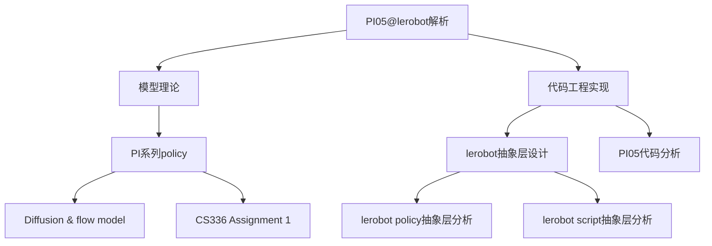

> [!NOTE] 注意
> 本笔记是针对 OpenPI 实验室的 PI 系列建模进行分析，更偏重理论层面，由于PI系列是基于 VLA 的模型，所以需要 Transformers [[CS336 Assignment 1]] 基础和 Flow model [[Diffusion & Flow model]] 才能看懂。
> 至于代码实现，可以查看[[PI05代码分析]]、[[Lerobot Policy 抽象层分析]]和[[Lerobot Script 抽象层分析]]]

> [!NOTE] 注意
> 本文主要聚焦PI系列策略的建模，所以不会特别提及模型的训练方式和训练集，尽管这两个方向可以说和建模同等重要，这部分可以查看[[pi0.5]]，虽然这部分因为是早期文章所以稍显稚嫩，可能考虑重构一下。
## PI0
整体来说，PI 系列的强大性能并不是源自其颠覆性的模型架构，而是来自优秀的能有效利用大量数据的模型架构、大量优质数据和广泛分布的数据、大量算力的结果，这也符合 Dario 的「Big Blob of Compute Hypothesis」。
### PI0 模型架构
当然，对这个模型本身的提升也是不容忽视，它在文中直接提到了模型架构的启发者：[Transfusion](https://arxiv.org/abs/2408.11039) 这个多模态模型。具体来说，PI0 采用了将图像和关节状态通过一个线性投影层 embed 到和语言 token 一样的 embedding space 中，然后使用了 Flow matching 的模型来实现对连续动作空间的建模。这两点都是直接从 Transfusion 中跨领域获取的知识。

同时，论文发现把动作状态和画面语言使用不同的权重可以带来性能上的提升，类似一种 MoE 思想，但是是硬编码了不同类型数据走不同通道。对于不同数据，采用不同的 attention 权重和不同的 FFN 权重，可以说是使用了两个模型，但是 action 部分能单向 attention 到视觉语言部分的权重。
如图，改模型使用两到三路 ViT SigLIP 来接收三个摄像头的画面并将其 embed 到统一的 embedding space 中，同时和语言指令一起拼接输入 PaliGemma 模型，以及有一个 action expert 同时处理机器状态 $q_t$。
在 Transformer 内部是两个模型并行处理不同的数据，即在每一层 Transformer 中：
第一步：各 expert 独立计算 Q、K、V
```
VLM expert:     [img tokens, lang tokens] → 用 VLM 的 Q,K,V 权重 → Q_vlm, K_vlm, V_vlm
Action expert:  [proprio tokens, action tokens] → 用 Action 的 Q,K,V 权重 → Q_act, K_act, V_act
```
第二步：K、V 拼接成全局 KV，做 cross-expert attention
```
Global K = concat(K_vlm, K_act)
Global V = concat(V_vlm, V_act)

VLM tokens:    Q_vlm    × Global K/V → attention output (受 block mask 限制只看 VLM 自己)
Action tokens: Q_act    × Global K/V → attention output (可以看到所有 token)
```
这里的 Cross attention 就像原始 Transformer 中用 encoder 的 Q 和 decoder 的 KV 进行 attention，但是这里是 cross-expert，即是使用全局的 KV 来和 action expert 部分的 Q 进行 attention，此处由于 VLM 部分是被 mask 看不到动作部分的信息，所以和只和自己做 attention 没区别。

第三步：各自过自己的 FFN
```
VLM attention output    → VLM FFN
Action attention output → Action Expert FFN
```

因为一次推理的时候所有 token 都保持不变，但是 flow model 需要10步采样，所以还可以用 KVCache 来优化。

### PI0 训练与推理
来到公式部分，模型理论上想要求一个数据分布 $p(\mathbf{A}_t|\mathbf{o}_t)$ 其中 $\mathbf{A}_t=[a_t,a_{t+1},\cdots,a_{t+H-1}]$ 来代表要求的一个 action chunk，$\mathbf{o}_t=[\mathbf{I}_t^1,\cdots,\mathbf{I}_t^n,\ell_t,\mathbf{q}_t]$ ，其中 $\mathbf{I}_t^i$ 是第 $i$ 个图像，$\ell_t$ 是一串字符 tokens，$\mathbf{q}_t$ 是关节角度的向量。也就是说 PI0 是个纯依赖当前状态的马尔可夫决策过程，虽然输出的 action chunking 本身隐含部分时序结构，但是在长程任务上还是性能较弱。然后模型通过求 flow matching loss 来优化：
$$
L^\tau(\theta) = \mathbb{E}_{p(\mathbf{A}_t | \mathbf{o}_t),\; q(\mathbf{A}_t^\tau | \mathbf{A}_t)} \left\| \mathbf{v}_\theta(\mathbf{A}_t^\tau, \mathbf{o}_t) - \mathbf{u}(\mathbf{A}_t^\tau | \mathbf{A}_t) \right\|^2
$$
其中：
- $\theta$: 模型的可学习参数；
- $\tau$: flow matching 中的"时间", $\tau \in [0, 1]$，1 表示干净数据，0 表示纯噪声（注意这里用 $\tau$ 而不是 $t$，因为 $t$ 已经被用来表示机器人的物理时间步了）；
- $\mathbf{o}_t$: 时间步 $t$ 的观测，包括图像 $\mathbf{I}_t$、语言指令 $\ell_t$、关节角度 $\mathbf{q}_t$ ； 
- $\mathbf{A}_t = [\mathbf{a}_t, \mathbf{a}_{t+1}, \ldots, \mathbf{a}_{t+H-1}]$: 从时间步 $t$ 开始的 action chunk，即未来 $H = 50$ 步的动作序列，这是 ground truth；  
- $\mathbf{A}_t^\tau$: 把干净的 action chunk $\mathbf{A}_t$ 沿 flow matching 路径加噪到"时刻 $\tau$"的结果，即 $A_t^\tau = \tau A_t + (1-\tau)\epsilon$，其中 $\boldsymbol{\epsilon}$ 是高斯噪声，也就是 0 时刻的纯噪音选用的是高斯噪音。

> [!NOTE] 注意
> PI0 的 Flow matching 采用 1 时刻表示干净数据，0 时刻表示纯噪音的方式，是两种表示形式之一，对结果没有影响。

给到 $\mathbf{A}_t^\tau$ 关于 ground truth 动作 $\mathbf{A}_t$ 的分布:
$$
q(\mathbf{A}_t^\tau | \mathbf{A}_t) = \mathcal{N}(\tau \mathbf{A}_t, (1-\tau)\mathbf{I})
$$
实际训练中通过插值获得训练参考：
$$
\mathbf{A}_t^\tau = \tau \mathbf{A}_t + (1-\tau)\boldsymbol{\epsilon}, \quad \boldsymbol{\epsilon} \sim \mathcal{N}(0, \mathbf{I})
$$
然后用模型输出 $\mathbf{v}_\theta(\mathbf{A}_t^\tau, \mathbf{o}_t)$ 来拟合去噪速度场 $\mathbf{u}(\mathbf{A}_t^\tau | \mathbf{A}_t) = \boldsymbol{\epsilon} - \mathbf{A}_t$ （这里这个负号不知道哪里来的）。

在推理中，使用随机噪音 $\mathbf{A}_t^0 \sim \mathcal{N}(\mathbf{0}, \mathbf{I})$，然后使用欧拉积分法来推理：
$$
\mathbf{A}_t^{\tau+\delta} = \mathbf{A}_t^\tau + \delta \mathbf{v}_\theta(\mathbf{A}_t^\tau, \mathbf{o}_t),
$$
$\delta$ 是积分的时间步，此处采用 10 步积分，即 $\delta=0.1$ 。

## PI05

总体来说，PI05 相比 PI0 多设计了一个高阶 subtask 规划方式以及在离散/连续空间上进行了优化，但是整体的模型架构和 PI0 上没有「颠覆性」的变化。同时修改了训练数据和训练方式。

## PI05 模型架构
总体来说，PI05 没有改变VLM 加上 action expert 构成 VLA 的架构。但是没有像 PI0 那样只依赖当前状态的观察 $\mathbf{o}_t$，而是使用自回归的方式输出 subtask：
$$
\pi_\theta(\mathbf{a}_{t:t+H}, \hat{\ell}|\mathbf{o}_t, \ell) = \pi_\theta(\mathbf{a}_{t:t+H}|\mathbf{o}_t, \hat{\ell})\pi_\theta(\hat{\ell}|\mathbf{o}_t, \ell)
$$
$\ell$是总体的任务提示词，$\hat{\ell}$是模型tokenized文字输出，$\mathbf{o}_t$是摄像头和关节信息。与 PI0 的使用线性投影层不同 embed 机械臂状态不同，PI05 采用将所有机械臂状态离散化并转为 text tokens 的方法。

对于 high level 和 low level 任务生成，模型会干两件事：
1. 首先根据总的命令生成不同的 subtask，这个是由自回归模型来做的，不再是一个马尔可夫决策过程，是公式中的 $\pi_\theta(\hat{\ell}|\mathbf{o}_t, \ell)$ 部分。这部分是单纯的 VLM 部分的输出，不涉及 action expert；
2. 然后是接受 subtask，观察 $\mathbf{o}_t$ 和转为离散 token 的机械臂状态 $q_t$，这里就是和 PI0 相近的运算方式了，全部信息分别进入 VLM 和 action expert，action expert 可以对 VLM 中的 KV 矩阵进行 cross attention，输出连续的动作。

同时，PI05 很强调离散和连续动作空间的统一。论文强调，VLA 的训练如果采用离散的动作表示的话，训练速度会快得多，因为 tokenizer 会高效地压缩动作块，因此 VLM 本身也是一个自回归的 VLA。同时，模型保留了 flow model 的设计来更好地适应真实的推理。因为离散化动作训练比较快，所以在预训练的时候采用的是直接训练自回归的动作离散化 VLA 模型。

PI05 模型在 flow model 部分注入时间步的方式有了一个较小的改变，改成了 DiT 论文中的 Adaptive Layer Norm 来注入时间步，也算是改为了学界的最佳实践。

## PI05 训练
PI05 的推理上文中已经讲过了，其训练也比较简单，是用过优化来求一个联合误差的最小值：
$$
\mathbb{E}_{\mathcal{D}, \tau, \omega} \bigg[ H\big(x_{1:M}, f_\theta^\ell(\mathbf{o}_t, \ell)\big) \\
+ \alpha \left\| \omega - \mathbf{a}_{t:t+H} - f_\theta^a(\mathbf{a}_{t:t+H}^{\tau,\omega}, \mathbf{o}_t, \ell) \right\|^2 \bigg],
$$
- 其中 $H\big(x_{1:M}, y_{1:M}^{\ell}\big)$ 是下一个 token 和模型预测 logits 之间的交叉熵损失;
- $y_{1:M}^{\ell}=f_\theta^\ell(\mathbf{o}_t, \ell)$ 是 action expert 的输出;
- $\alpha$ 是一个权衡参数，可以让模型先按照一个标准 VLM 进行训练，然后再加上对 flow matching 模型的训练

这样，在推理的时候就可以用标准自回归生成 subtask，然后接着依赖subtask token 的 10 步的去噪过程，最后用一个线性映射（linear mapping）来获取连续的动作块。

但是论文中没有说如何切换两种不同的推理方式。官方仓库也只有生成动作的模式，没有生成高阶子任务的模式，Claude 推测是依赖一个硬路由和 suffix 来让模型强制进入其中一个推理模式，可以见[issue#647](https://github.com/Physical-Intelligence/openpi/issues/647)。