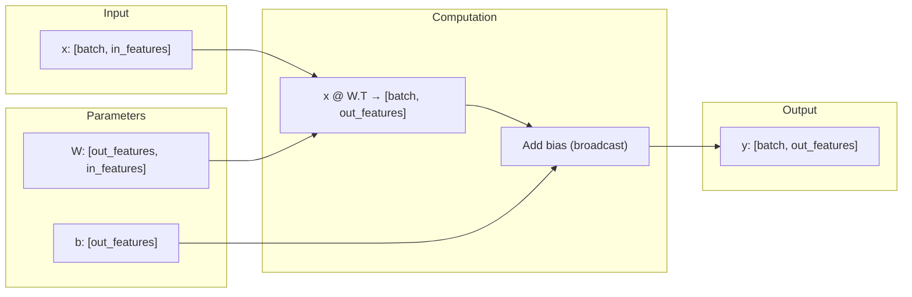

## Transformer概述
以原始Transformer为例，讲解一遍其中的子层和各部分有什么用：

1. 注意力机制
	此部分是Transformer核心中的核心，指代的图中的橙色部分，大致分为三类：多头自注意力机制，masked多头注意力机制，交叉注意力（cross attention）机制。
	注意力的核心是构建：
	- Query 问询矩阵，这个矩阵会包含“需要获得什么信息”
	- Key 键矩阵，这个矩阵会包含“句子有什么信息能被检索”
	- Value 值矩阵，这个矩阵会包含“句子能提供什么信息”
	- 以上三个矩阵是由$W^Q/W^K/W^V \cdot X$得到，X是输入的信息
	多头会在实现注意力机制的时候详细讲解，自注意是指在encoding中所有上述三个值都由Inputs获得，交叉注意力是指decoding中K和V矩阵是由encoder给出，Q是由decoder的masked注意力机制给出。masked注意力机制是因为在训练中是要给出outputs的完整序列，若是decoder能看到将要预测的信息，则训练没有意义，所以在decoder的output上加了mask机制
2. Tokenization&embedding
	简而言之，这两者是将由utf-8编码的文字转为便于训练的数字并投影到一个连续的向量空间中。具体实现见后文。
3. 前馈神经网络&归一化
	但是注意力机制本质上就是线性混合，并没有强大的非线性表达能力，加上一层神经网络，可以大大增强其非线性表达能力。而归一化则防止了梯度爆炸和梯度消失，更有利于模型训练。
	同时模型设计了残差连接，即输入神经网络和归一化层的x会加在这个层的输出上，这样同样缓解梯度爆炸/消失，有利于模型优化
4. 最后加上一层线性函数和softmax，在词表中选取输出的词汇。


整整50页的handout😰，先通读一遍，洋文怎么那么难懂。
整个assignment要求实现：
- 一个BPE分词器(tokenizer)
- transformer语言模型
- 交叉熵损失函数和AdamW优化器
- 训练函数
assignment给出了一些数据以供学习，目前不知道训练能不能用消费级GPU完成，不排除要租算力的可能。

**禁止使用**`torch.nn`, `torch.nn.functional`, or `torch.optim`这些类，除了：
- `torch.nn.Parameter`
- Container classes in `torch.nn` (e.g., `Module`, `ModuleList`, `Sequential`, etc.) 见[官方文档](https://pytorch.org/docs/stable/nn.html#containers)以见container类
- `torch.optim.Optimizer` base class

要求完成：
- `cs336_basics/*`：所有code都要继承在这个文件夹下，具体实现可自由发挥。
- `adapters.py`：要求必须在你的函数中实现这个文件中的所有接口，通过调用手搓的函数来完善这个文件，这是用于调用所写函数的“胶水代码“
- `test_*.py`：要通过的所有测试。

## Tokenizer
### UTF-8 编码方式
|Unicode 范围（码点）|UTF-8 字节数|二进制格式（`x` 表示有效位）|
|---|---|---|
|U+0000 – U+007F|1 字节|`0xxxxxxx`|
|U+0080 – U+07FF|2 字节|`110xxxxx 10xxxxxx`|
|U+0800 – U+FFFF|3 字节|`1110xxxx 10xxxxxx 10xxxxxx`|
|U+10000 – U+10FFFF|4 字节|`11110xxx 10xxxxxx 10xxxxxx 10xxxxxx`|
### 训练方式
作业提出需要使用BPE方式进行分词训练，主要有以下三步：
1. Pre-tokenization：如果此时开始merge的话便会导致标点对分词产生影响，导致分出两个词义相差无几却分成不同词的情况，所以GPT-2的实践形式是先用正则化分出标点和单词，分别进行分词，导致标点不影响分词。
```Python
>>> PAT = r"""'(?:[sdmt]|ll|ve|re)| ?\p{L}+| ?\p{N}+| ?[^\s\p{L}\p{N}]+|\s+(?!\S)|\s+"""
>>> # requires `regex` package 
>>> import regex as re 
>>> re.findall(PAT, "some text that i'll pre-tokenize") ['some', ' text', ' that', ' i', "'ll", ' pre', '-', 'tokenize']
```
2. 词汇初始化：将所有词汇按照UTF-8的编码转为原码，之后按照字节进行拆分，由于一个字节大小是256，所以初始的词汇表是256.
3. 训练分词器：依照频数对最高的词进行融合
**注意**：需要对`<|endoftext|>`这个特殊的字符进行分词，并保证分词不变。

**提升性能**
分词可能很慢，可以通过`multiprocessing`这个自带库进行并行计算加快pre-tokenization这步，可以查看[实例](https://github.com/stanford-cs336/assignment1-basics/blob/main/cs336_basics/pretokenization_example.py)来学习
**提前分词**
需要把`<|endoftext|>`纳入考虑，可以用`re.split`分为两个文本后用`|`连接起来。
### 优化
吭哧吭哧做完了，在自己的测试上跑通了，但是在官方测试上超时了😭

改进：
1. 用int将bytes替换，在最后输出时再替换为byte。每合并一个字符就给这个字符赋予一个新的id，最后用这个字典将id转为bytes，同时在运行过程中维护这样的字典。按照gpt所说，这应该能让我勉强过线，先试试看🤓
2. 实际不行，检测每步操作时间。
	```
	Time to delete words: 0.02 seconds
	Time to encode text: 0.01 seconds
	Time to train BPE: 5.96 seconds
	Time to find most frequent pair: 0.02 seconds
	Time to merge byte sequences: 0.02 seconds
	```
	可以发现性能瓶颈主要在训练上，虽然每一次删除和融合速度都较快，但是数百次融合和求最多字符对导致时间累计得很大。因此，改为采用最大堆和惰性校验方法。
	- 原始方式：先遍历整个token库O(N)，找到最多的token对，然后遍历整个token库把这个token对merge掉O(N) 。
	- 半优化方式：在最开始统计seq_pair O(N)，然后维护一个最大堆，每次循环从最大堆中选取最大的token对，并和seq_pair比较，数量相同才选取，然后merge他两并惰性遍历整个token库得到部分更新的seq_pair
	- 实际上还有业界的最优化算法，貌似挺复杂的暂时不采用。
需要更新的函数：
- 整个train_bpe()
- merge的时候同时惰性更新seq_pair
- 增加最大堆。
**注意**：当多个token对对数并列时，选取**字典序数最大的那个**
成功使得运行时间控制到1s左右。
但是在后期merge仍然有冲突，猜测可能是并列的时候没有处理好导致的，无力再修了，直接在网上抄个答案(结果有的也有问题……)。
[stanford-cs336-a1/cs336_basics/BPETokenizer.py at main · Spectual/stanford-cs336-a1](https://github.com/Spectual/stanford-cs336-a1/blob/main/cs336_basics/BPETokenizer.py)
这个是没问题的。一个分词器就写了三天……
接下来是Transformer的核心组件：embedder，encoder，decoder，softmax等
## Transformer Language Model Architecture
现在的语言大模型不同于Ateention is all you need中的架构，一般都是先进行归一化，输入encoder后再进入残差神经网络。语言大模型接受`(batch_size, sequence_length)`维度的输入，之后输出`(batch_size, sequence_length, vocab_size)`大小的输出，取其中概率最高的词作为lm下一个输出的词，然后用实际的下一个词计算交叉熵损失。
以下列举一些lm的模块：
- embedder
	transformer把一系列token ID转为连续的向量，具体的是把`(batch_size, sequnce_langth)`的向量转为`(batch_size, sequence_length, d_model)`
- 归一化前的transformer模块
	经过`num_layers`个Transformer层，我们会把最终的结果转为词的分布。现在的实现是把归一化放在encoder后的，归一化后，我们将使用一个标准的训练过的线性转化把输出转为预测下一个token的向量。
### Torch中的行/列向量与广播机制
**行向量 (row vector)**
数学上是形状 **\[1, n]**，一行 n 列。

常见写法

```python
import torch

# 一维向量 (等价于行向量，会自动广播)
row1 = torch.tensor([1., 2., 3.])        # shape: [3]

# 显式行向量
row2 = torch.tensor([[1., 2., 3.]])      # shape: [1, 3]

print(row1.shape)  # torch.Size([3])
print(row2.shape)  # torch.Size([1, 3])
```

✅ 在矩阵加法中，这两者都会表现为「行向量」，差别只是 `row1` 是一维，`row2` 是二维。


**列向量 (column vector)**

数学上是形状 **\[n, 1\]**，n 行一列。

常见写法

```python
# 显式列向量
col = torch.tensor([[1.], [2.], [3.]])  # shape: [3, 1]

# 或者把行向量转置
row = torch.tensor([[1., 2., 3.]])      # shape: [1, 3]
col2 = row.T                            # shape: [3, 1]

print(col.shape)   # torch.Size([3, 1])
print(col2.shape)  # torch.Size([3, 1])
```


**用 `unsqueeze` / `view` 控制维度**

如果你一开始是 **一维向量 `[n]`**，可以用这些方法转为行/列向量：

```python
v = torch.arange(1, 4)     # shape: [3] = [1, 2, 3]

# 行向量
row = v.unsqueeze(0)       # [1, 3]

# 列向量
col = v.unsqueeze(1)       # [3, 1]

print(row.shape)  # torch.Size([1, 3])
print(col.shape)  # torch.Size([3, 1])
```

**广播机制**
为了出发广播机制，进行运算的张量必须满足以下条件：
- 每个张量至少有一个维度。  
- 迭代维度尺寸时，从**尾部**的维度开始，维度尺寸  
	- 或者**相等**，  
	- 或者**其中一个张量的维度尺寸为 1** ，  
	- 或者**其中一个张量不存在这个维度**。
示例：
```Python
# 示例5：可广播
c = torch.empty(5, 1, 4, 1)
d = torch.empty(   3, 1, 1)
(c + d).size()  # torch.Size([5, 3, 4, 1])


# 示例6：可广播
f = torch.empty(      1)
g = torch.empty(3, 1, 7)
(f + g).size()  # torch.Size([3, 1, 7])


# 示例7：不可广播
o = torch.empty(5, 2, 4, 1)
u = torch.empty(   3, 1, 1)
(o + u).size()

# 报错：
# ---------------------------------------------------------------------------
#
# RuntimeError                              Traceback (most recent call last)
#
# <ipython-input-17-72fb34250db7> in <module>()
#       1 o=torch.empty(5,2,4,1)
#       2 u=torch.empty(3,1,1)
# ----> 3 (o+u).size()
#
# RuntimeError: The size of tensor a (2) must match the size of tensor b (3) at non-singleton dimension 1
```

### 数学表示
对于如`numpy`和`pytorch`等数学库，通常写作的是行向量，比如创建一个`Linear(in_feature, out_feature)`中：
- `weight.shape = (out_feature, in_feature)`
所以，在线性代数中的公式$y=Wx$，在这类库中要写成$y = x @ W.T$，这样有利于调用底层的矩阵运算库。


### 线性模型
Assignment要求实现一个线性模型，实现：
- `def __init__(self, in_features -> int, out_features -> int, device=None, dtype=None)`
- `def forward(self,x:torch.Tensor)->torch.Tensor`
要求：
 - 为`nn.Module`子类
 - 继承父类
 - 用`W`而非`W^T`来储存参数，这样更高效，并且同时用`nn.Parameter`包装
 - 用`torch.nn.init.trunc_normal_`来初始化
 - 不允许使用`nn.Linear`或`nn.functional.linear`
初始化：
- 线性权重：$\mathcal{N}\left(\mu=0, \sigma^{2}=\frac{2}{d_{\text{in}}+d_{\text{out}}}\right)$ 截断于 $[-3\sigma, 3\sigma]$。 
- Embedding：$\mathcal{N}\left(\mu=0, \sigma^{2}=1\right)$ 截断于 $[-3, 3]$ 
- RMSNorm: $\mathbb{I}$(全1向量)


广播机制会把`b:[out_features]`扩展为`b:[batch_size,out_features]`，但是此处好像不需要设置bias项，只要求实现一个线性变化。同时注意`torch`的实现惯例是把W当作`[out_feature,in_feature]`的向量

`nn.Parameter`
- `nn.Parameter` 是 `torch.Tensor` 的子类。
- 它的特别之处在于：
    - 当你把 `Parameter` 放到一个继承自 `nn.Module` 的类里时，PyTorch 会**自动把它注册为模型的可训练参数**。
    - 这意味着：优化器（如 `torch.optim.SGD`、`Adam`）在调用 `model.parameters()` 时会找到它，并更新它的值。
    - 可以用于你希望在训练中被优化的张量如**权重矩阵 W** 和 **偏置向量 b**。
### Embedding
参考文献：[Glossary of Deep Learning: Word Embedding | by Jaron Collis | Deeper Learning | Medium](https://medium.com/deeper-learning/glossary-of-deep-learning-word-embedding-f90c3cec34ca)，[Cross-Entropy Loss Function in Machine Learning: Enhancing Model Accuracy | DataCamp](https://www.datacamp.com/tutorial/the-cross-entropy-loss-function-in-machine-learning)
Embedding层是将Tokenizer输出的id映射到`d_model`维度的向量空间。要求实现：
- 维度上的降维
- 语义上的近似

实际上就是一个大矩阵，把tokenizer训练的`bytes2int`字典中的每个token的id转化成独热编码，把独热编码输入线性网络后输出映射在向量空间上的向量。而训练则分为独立训练与和下游网络一起训练两种方式。
- 同下游网络一起训练是当下端到端的训练的常见形式
- 早期或者微调阶段的embedding也会用CBOW等方法独立训练
此处要求实现：
- \_\_init\_\_(self, num\_embeddings, embedding_dim, device=None, dtype=None): 构建一个嵌入模块。此函数应接受以下参数： 
	- num_embeddings: int 词汇表的大小 
	- embedding_dim: int 嵌入向量的维度，即 $d_{\text{model}}$ 
	- device: torch.device | None = None 存储参数的设备 
	- dtype: torch.dtype | None = None 参数的数据类型 
- def forward(self, token_ids: torch.Tensor) -> torch.Tensor: 
	查找给定 token ID 的嵌入向量。 
确保： 
- 继承自 nn.Module 
- 调用超类构造函数 
- 将你的嵌入矩阵初始化为 nn.Parameter 
- 将嵌入矩阵存储为最终维度为 $d_{\text{model}}$ 
- 不要使用 nn.Embedding 或 nn.functional.embedding 
再次使用上述设置进行初始化，并使用 torch.nn.init.trunc_normal_ 初始化权重。

## 预归一化Transformer模块
所有Transformer都有两个模块：多头注意力机制和前馈神经网络
在初始的Transformer中，模型在两个sub-Layersz中使用了归一化加上残差连接，现在常称为“后归一化(post-norm)”。然而研究发现使用前归一化可以有效提升模型训练稳定性。可以理解为每一个Transformer块输出的内容会不经归一化“纯净”地进行残差连接。接下来会遍历预归一化的Transformer的所有内容，一连串地实现它们。
### 均方根层归一化
原始的Transformer使用均方根来进行归一化：
$$\mathbb{R}\text{MSNorm}(a_i)=\frac{a_i}{\text{RMS(a)}}g_i$$
其中$\text{RMS}(a)=\sqrt{\frac1{d_model}\sum_{i=1}^{d_model}a_i^2+\epsilon},\quad g_i\text{是一个可以学习的增益(gain)参数，而}\epsilon=1e-5$
注：可以将参数转为`torch.float32`来防止溢出。比如你的`forword()`应该如此写：
```Python
in_dtype = x.dtype 
x = x.to(torch.float32) 
# Your code here performing RMSNorm 
... 
result = ... 
# Return the result in the original dtype 
return result.to(in_dtype)
```
同时注意输入张量的维度是`[batch_size, seq_length, d_model]`，求和的时候对最后一维求和。

`dim`参数在`max, mean, sum`等函数中不同参数的含义：
`dim`为0和1时分别表示对行求和和对列求和，也可以用负数表示倒数第几个维度，比如下列向量：
```Python
x = torch.tensor([[1, 2, 3],
                  [4, 5, 6]])
x.sum(dim=0)
tensor([5, 7, 9])   # [1+4, 2+5, 3+6]
x.sum(dim=1)
tensor([ 6, 15])   # [1+2+3, 4+5+6]
```
同时可以使用`keepdim=true`来保留求和的那个维度，防止降维，这个可用于广播机制。
```Python
x.sum(dim=0, keepdim=True)
tensor([[5, 7, 9]])   # shape [1, 3]
x.sum(dim=1, keepdim=True)
tensor([[ 6],
        [15]])        # shape [2, 1]
```

### 前馈神经网络
此处前馈神经网络指的是只沿着输入层->中间隐藏层->输出层的无环神经网络。
不同于原始Transformer使用的`Relu`层，现代LLM更倾向于使用另一个激活层和Gating机制，此处assignment要求我们实现一个结合了`SiLU`激活层和`GLU`gating 机制的激活层叫`SwiGLU`：
$$
\begin{aligned}
\text{ReLU}(x) &=\max(x,0 )\\ 
\text{SiLU}(x) &= x\cdot \sigma(x) = \frac{x}{1+e^{-x}}\\
\text{GLU}(x, W_1, W_2) &=\sigma(W_1x)\odot W_2x\\
\text{FFN}(x) = \text{SwiGLU}(x, W_1, W_2, W_3) &= W_2 (\text{SiLU}(W_1 x) \odot W_3 x),\\
x\in\mathbb{R}^{d_{model}},W_1,W_3\in\mathbb{R}^{d_{ff}\times d_{model}},&W_2 \in \mathbb{R}^{d_{model}\times d_{ff}},d_{ff} = \frac 83 d_{model}
\end{aligned}
$$
其中$\odot$表示逐元素相乘，如果使用`Sigmoid/tanh`等激活函数，可能导致梯度消失，而`ReLU`等函数则可能导致恒为0的神经死亡。geting机制在使用`Sigmoid`函数的同时乘以了一个线性函数，把`Sigmoid`函数作为了一个“门控作用”。此处可以使用`torch.sigmoid()`函数。

**注意**：因为`x`的维度通常是`[batch_size, seq_length, d_model]`，要与`[d_ff, d_model]`的`W`相乘。需要运用广播机制的话，要求左张量的最后一维和右张量的倒数第二位相等，所以要`x @ W.T -> [batch_size, seq_length, d_model] @ [d_model, d_ff]`
### 相对位置Embeddings
因为Transformer没有前后文的概念，对其只有矩阵的概念，所以要给所有的token加上一层position的embedding，让模型学习到“前后的概念”。直观上来说，应该在`seq_length`维度上对经过embedding的$q^i$加上position embedding，这样才能体现token串的前后关系，实际上2017年原始的Transformer也是这么做的。但是Assignment要求实现`Rope`方法，此方法将最后一维`d_model`视为复平面，把不同维度对当作“旋转平面”，用位置$i$决定旋转角度。也就是说把`d_model`两两分组，一个视为实轴，一个视为虚轴，然后用
$$ R(\theta) = \begin{bmatrix} \cos \theta & -\sin \theta \\ \sin \theta & \cos \theta \end{bmatrix} $$
对$(x_{2k-1},x_{2k})$进行旋转，即对$z = x_{2k-1} +i x_{2k}$乘上一个旋转因子$e^{i\theta}$。考虑到对前后建模
$$ R_k^i = \begin{bmatrix} \cos(\theta_{i,k}) & -\sin(\theta_{i,k}) \\ \sin(\theta_{i,k}) & \cos(\theta_{i,k}) \end{bmatrix}. $$
其中$\theta_{i,k} = \frac{i}{\Theta^{(2k-2)/d}}.$，这里的优点是可以表达每个token的相对前后顺序并且便于计算(可以直接乘以矩阵，而不是对每个向量加)，最后得到：
$$ R^i = \begin{bmatrix} R_1^i & 0 & 0 & \cdots & 0 \\ 0 & R_2^i & 0 & \cdots & 0 \\ 0 & 0 & R_3^i & \cdots & 0 \\ \vdots & \vdots & \vdots & \ddots & \vdots \\ 0 & 0 & 0 & \cdots & R_{d/2}^i \end{bmatrix}, $$

也就是对于$i\in\{1,\cdots,seq\_len\},k\in\{1, \cdots, \frac d2\}$，则对于每个$x^i\in\mathbb{R}^d$，可以把其分为$\frac d2$组，然后对其乘上$R^i$矩阵，最后再拼接回去，得到经过position embedding的向量。(实践中k是从0开始记得，所以计算$\theta$的公式也得改)

同时，虽然直接构建一个大矩阵是个不错的主意，但是这样这个大矩阵里面有太多0，对计算并无帮助还会占用性能，注意到：
$$
\begin{aligned}
R^i &= \mathrm{diag}(R_1^i, R_2^i, \ldots, R_{d/2}^i), \quad R_k^i \in \mathbb{R}^{2 \times 2} \\
 R^i x^{(i)} &= (R_1^i [x_1, x_2]^T, R_2^i [x_3, x_4]^T, \ldots) \\
x'_{2k} &= x_{2k} \cos\theta_{i,k} - x_{2k+1} \sin\theta_{i,k}\\
x'_{2k+1} &= x_{2k} \sin\theta_{i,k} + x_{2k+1} \cos\theta_{i,k}
\end{aligned}
$$
同时会传入`position`数组，维度同`seq_len`相同，作为位置索引。
实现形式是计算一个`[seq_len, d/2]`的cos和sin矩阵，最后直接应用广播机制与x相乘。

### 点乘Softmax
公式没什么好说的：
$$
\text{softmax}(v)_i = \frac{\exp{v_i}}{\sum^n_{j=1}{\exp{v_j}}}
$$
但是注意到有时候$v$会过大，导致出现$\frac{\inf}{\inf}$的情况，对此，我们可以把这个向量每个元素减去最大的元素，把最大的元素变为0，可以有效缓解此现象。

可以用这个公式计算attention的score：
$$\text{Attention}(Q,K,V)=\text{softmax}\left( \frac{Q^TK}{\sqrt{d_k}}\right)V$$
其中：
$$ Q \in \mathbb{R}^{n \times d_k},\quad K \in \mathbb{R}^{m \times d_k},\quad V \in \mathbb{R}^{m \times d_v} $$
- $n$：query 的序列长度（通常是目标序列的长度，比如解码时的句子长度）。 
- $m$：key/value 的序列长度（通常是源序列的长度，比如输入句子的长度）。 
	- 在自注意力（self-attention）中，通常 $n = m$。 
	- 在交叉注意力（cross-attention，比如 encoder-decoder attention）中，$n$ 和 $m$ 可以不同。 
- $d_k$：query/key 的维度。 
	- Query 和 Key 必须在同一向量空间里才能计算内积（相似度）。 
	- 所以它们共享同一个维度 $d_k$。 
- $d_v$：value 的维度。 
	- Value 不参与相似度计算，它只是被“加权平均”后输出。 
	- 因此它的维度可以不同于 $d_k$，一般设为 $d_v = d_k$，但理论上可以不一样。
同时设计一个`mask`： $M \in {True,False}^{n×m}$，如果$M$矩阵为`False`,需要在此处的预softmax值加上$-\infty$。
算出来$Q^TK$之后再key维做softmax，求得要对哪个key值做注意力。
### 多头注意力机制
$$ \begin{aligned} \text{MultiHead}(Q, K, V) &= \text{Concat}(\text{head}_1, \ldots, \text{head}_h), \\ \text{where } \text{head}_i &= \text{Attention}(Q_i, K_i, V_i). \end{aligned} $$
理论上来说，多头注意力机制是将经过embedding的向量的最后一维`d_model`拆成`h`份，同时生成$Q_i,K_i,V_i$(对$d_k,d_v$的$i\in\{1,\cdots ,h\}$个切片)，这些头分别计算Attention分数，之后再拼接起来得到多头注意力，最后用一个矩阵把多头注意力的维度降为单头注意力的维度：
$$ \text{MultiHeadSelfAttention}(x) = W_O \cdot \text{MultiHead}(W_Q x, W_K x, W_V x) $$
但是具体实践中建立多个单头注意力并单独计算会非常影响性能，所以普遍的实践是把多头注意力的小矩阵在参数维度叠加起来，即：
$$
\begin{aligned}
&\textbf{输入：} \\
&\quad X \in \mathbb{R}^{n \times d_{\text{model}}}, \quad 
  \text{其中 $n$ 为序列长度，$d_{\text{model}}$ 为 embedding 维度。} \\

&\textbf{Step 1：线性投影并拆分为 $h$ 个头} \\
&\quad \text{对于每个头 $i \in \{1,\dots,h\}$，定义投影矩阵：} \\
&\quad W_Q^{(i)} \in \mathbb{R}^{d_{\text{model}} \times d_k}, \quad 
      W_K^{(i)} \in \mathbb{R}^{d_{\text{model}} \times d_k}, \quad 
      W_V^{(i)} \in \mathbb{R}^{d_{\text{model}} \times d_v}, \\
&\quad \text{其中 } d_k = d_v = \frac{d_{\text{model}}}{h}. \\

&\quad \text{得到每个头的投影结果：} \\
&\quad Q^{(i)} = X W_Q^{(i)} \in \mathbb{R}^{n \times d_k}, \\
&\quad K^{(i)} = X W_K^{(i)} \in \mathbb{R}^{m \times d_k}, \\
&\quad V^{(i)} = X W_V^{(i)} \in \mathbb{R}^{m \times d_v}. \\

&\textbf{Step 2：打分与注意力权重} \\
&\quad \text{对于每个头，注意力权重为：} \\
&\quad \text{Scores}^{(i)} = \frac{Q^{(i)} (K^{(i)})^\top}{\sqrt{d_k}} \in \mathbb{R}^{n \times m}, \\
&\quad A^{(i)} = \text{softmax}(\text{Scores}^{(i)}) \in \mathbb{R}^{n \times m}. \\

&\textbf{Step 3: 拼接矩阵加速}\\
&\quad 在实践中会使用W_Q = [[W_Q^1],[W_Q^2],\cdots,[W_Q^h]]\in \mathbb{R}^{d_{model}\times h\cdot d_k}拼接出来. \\
&\quad 同理W_K\in\mathbb{R}^{d_{model}\times h\cdot d_k},\quad W_V\in \mathbb{R}^{d_{model}\times h\cdot d_v}.\\
&\quad 之后再拆分Q\to(h,n,d_k​),\quad K\to(h,m,d_k​),\quad V\to(h,m,d_v​)\\
&\quad \text{Scores}=\frac{QK^T}{\sqrt{d_k}}\in \mathbb{R}^{h\times n\times m}. \\
&\quad \text{A}=\text{softmax}(\text{Scores})\in\mathbb{R}^{h\times n\times m}\\

&\textbf{Step 4：加权求和得到每个头的输出} \\
&\quad O^{(i)} = A^{(i)} V^{(i)} \in \mathbb{R}^{n \times d_v}. \\
&\quad 拼接矩阵的 O = AV\in\mathbb{R}^{h\times n\times d_v} \\

&\textbf{Step 5：拼接所有头并做最终线性变换} \\
&\quad \text{将 $h$ 个头的结果拼接：} \\
&\quad O = \text{Concat}(O^{(1)}, \dots, O^{(h)}) \in \mathbb{R}^{n \times (h \cdot d_v)}. \\
&\quad 拼接矩阵的O\to \mathbb{R}^{n \times (h \cdot d_v)}\\

&\quad \text{再用输出投影矩阵：} \\
&\quad W_O \in \mathbb{R}^{h \cdot d_v \times d_{\text{model}}}, \\
&\quad \text{得到最终输出：} \\
&\quad \text{MHA}(X) = O W_O \in \mathbb{R}^{n \times d_{\text{model}}}.
\end{aligned}

$$
**注意**：在handout中由于torch等库表示向量维度方式不同，可能有维度与上文所写的相反的情况。

在mask的时候，注意$\text{Score}\in \mathbb{R}^{h\times n\times m}$，其中n是解码的句子长度，m是输入的句子长度。在encoder时候，两者同长为`seq_len`，在decoder的时候不相同，m是encoder输入，n是decoder自回归输入。但是可以用padding使两者同长。至于为什么要把mask在自注意机制中写死，我也不是很清楚，理论上decoder需要mask机制是因为decoder需要自回归不断预测下一个词，所以在训练的时候要mask防止看到下一个词，而encode是不需要的，这是因为现在的llm并非原始Transformer模型，而是纯decoder模型，满足一个自回归的chatbot的任务需求。而原始Transformer则是进行翻译任务，需要提供原文和翻译，因此设计了encoder和decoder。

同时要求对$A$的每个头的query和key向量加上rope position embedding。

## The Full Transformer LM
完成了所有子层后，就可以着手组装完整的大语言模型。


一个Transformer包含两个子层，一个是多头注意力机制，另一个是前馈神经网络，在每一个子层，我们先运行一个`RMSNorm`进行归一化，然后运行各自的行动，最后加上一个残差连接。
对于前半个子层，应该实现对于给定一个$x$有$y$：
$$y = x+\text{MultiHeadSelfAttention}(RMSNorm(x))$$
之后y再输入前馈神经网络：
$$\text{output} = y + FF(RMSNorm(y))$$
最后通过一个归一化和线性网络。
写完整个模型架构之后只能感叹“好的研究是超出时代的”。

## 训练大语言模型
训练一个大语言模型主要需要三个部分：
- 损失函数：我们需要定义一个交叉熵损失函数
- 优化器(Optimizer)：定义一个优化器来最小化损失函数(AdamW)
- 训练循环：我们需要元件来装载数据，保存保存点以及管理训练
### 交叉熵损失
用交叉熵损失函数求损失，即：
$$H(p,q) = -\Sigma_x{ p(x)\log{q(x)}}$$
这里的$p$和$q$是概率分布，以softmax算法为例：
$$
\begin{aligned}
p &= [0,0,1],\quad q = [0.1,0.7,0.2]\\
H(p,q) &=-(0\times\log{0.1}+0\times\log{0.7}+1\times\log{0.2})
\end{aligned}
$$
其中因为输出是独热编码，所以可以直接省略$p(x)$而直接使用$q(x)$，即选中token的概率。
定义损失函数(D为一个batch，m为seq_len)：
$$\mathscr{l}(\theta;D) = \frac{1}{|D|m}\sum_{x\in D}\sum_{i=1}^m-\log{p_{\theta}(x_{i+1};x_{1:i})}$$
其中$$ p(x_{i+1} \mid x_{1:i}) = \text{softmax}(o_i)[x_{i+1}] = \frac{\exp(o_i[x_{i+1}])}{\sum_{a=1}^{\text{vocab\_size}} \exp(o_i[a])}. $$本题要求实现接受预测函数$o_i$和目标函数$x_{i+1}$然后计算损失函数$\mathcal{l}_i = -\log{\text{softmax}(o_i)[x_{i+1}]}$。并且实施和softmax相同的方法：
- 从所有值中减去最大值；
- 可能时，取消$\log$和$\exp$，即化简为$l_i = -o_i[x_{i+1}] + \log \sum_a \exp(o_i[a])$

### AdamW
对于SGD(随机梯度下降)来说，其完全依赖于上一步的梯度的优化方式使得各参数维度的量纲/曲率差很大，统一学习率$\eta$要么太大震荡、要么太小很慢。所以Adam优化方式提出以下方式来改善：
1. 动量
	$$ m_t = \beta_1 m_{t-1} + (1 - \beta_1) g_t, \quad \theta_{t+1} = \theta_t - \eta m_t $$
	直觉：把“最近一段时间的梯度”做平均来定方向（噪声抵消、方向更稳）。 这里的 $m_t$ 就是一阶矩估计（mean of gradient 的 EMA）。
2. RMSProp（= 二阶矩的 EMA 当作分母，做自适应步长）
	$$
	v_t = \beta_2 v_{t-1} + (1 - \beta_2) g_t^2, \quad \theta_{t+1} = \theta_t - \eta \frac{g_t}{\sqrt{v_t + \varepsilon}}
	$$
	**直觉**：$\sqrt{v_t}$ 近似“最近一段时间梯度幅度的均方根”（RMS）。
	- 某维度梯度总是很大/很抖 $\Rightarrow \sqrt{v_t}$ 大 $\Rightarrow$ 该维步长自动变小（更稳）；
	- 某维度梯度一直很小/平稳 $\Rightarrow \sqrt{v_t}$ 小 $\Rightarrow$ 自动放大学习率（更快）。
	这里的 $v_t$ 就是 **二阶矩估计**（mean of squared gradient 的 EMA）。
> **注意**：我们用的是 $\mathbb{E}[g^2]$（二阶矩），不是方差 $\text{Var}(g)$。因为做尺度归一化只需要“量纲/能量”的量级，$\mathbb{E}[g^2]$ 更直接、总是非负，且实现简单稳定。

3. Adam = Momentum（分子稳方向） + RMSProp（分母调步长）
	$$
	\begin{aligned}
	m_t &= \beta_1 m_{t-1} + (1 - \beta_1) g_t \quad &\text{(一阶：平均方向)} \\
	v_t &= \beta_2 v_{t-1} + (1 - \beta_2) g_t^2 \quad &\text{(二阶：RMS 尺度)} \\
	\hat{m}_t &= \frac{m_t}{1 - \beta_1^t}, \quad \hat{v}_t = \frac{v_t}{1 - \beta_2^t} \quad &\text{(偏置校正)} \\
	\theta_{t+1} &= \theta_t - \eta \frac{\hat{m}_t}{\sqrt{\hat{v}_t + \varepsilon}}
	\end{aligned}
	$$
	- **为什么要偏置校正？**  
	  刚开始 $m_0 = v_0 = 0$，EMA 在早期会被“拉向 0”。除以 $(1 - \beta^t)$ 是把这个起步偏差纠正掉，不然前几步太保守。
	- **单位直觉**：  
	  分子像“平均梯度”，分母像该维度的“RMS 尺度”。$\frac{\hat{m}}{\sqrt{\hat{v}}}$ 近似在做**无量纲化/预条件**（不同维同等可比），所以叫**自适应学习率**。
4. AdamW：在 Adam 基础上做“真正的权重衰减”
	Adam 主更新后再做一次**等比例收缩**（而不是把 $\lambda \theta$ 混入梯度）：
	$$
	\theta_{t+1} = \theta_t - \eta \frac{\hat{m}_t}{\sqrt{\hat{v}_t + \varepsilon}} - \eta \lambda \theta_t
	$$
	**动机**：让“每步按同一比例缩小参数”的直觉在自适应法里也成立（不被分母重缩放污染），更可控、泛化更好。

```
Algorithm 1: AdamW Optimizer
init(θ)                          // Initialize learnable parameters
m ← 0                            // Initial value of the first moment vector; same shape as θ
v ← 0                            // Initial value of the second moment vector; same shape as θ

for t = 1, ..., T do
    Sample batch of data B_t
    g ← ∇_θ ℓ(θ; B_t)           // Compute the gradient of the loss at the current time step
    m ← β₁ m + (1 - β₁) g        // Update the first moment estimate
    v ← β₂ v + (1 - β₂) g²       // Update the second moment estimate
    α_t ← α ⋅ √(1 - (β₂)^t) / (1 - (β₁)^t)  // Compute adjusted α for iteration t
    θ ← θ - α_t ⋅ m / √(v + ε)   // Update the parameters
    θ ← θ - α λ θ                // Apply weight decay
end for
```

   **说明**： 
   - `α` 是学习率，`β₁`, `β₂` 是动量系数，`ε` 是小常数防止除零。 
   - `α_t` 是经过偏置校正的步长因子。 
   - 最后一步独立应用权重衰减（weight decay），实现“真正的权重衰减”。
#### torch.optim.Optimizer类
Optimizer类的核心职责：
- **参数组织**：把待优化的 `nn.Parameter` 以“参数组（param group）”的形式管理，便于不同组用不同超参。
- **状态管理**：提供 `self.state` 字典，给每个参数存放持久化状态（如动量、一阶/二阶矩、步数等）。
- **统一的 step 接口**：定义 `step(closure=None)`，由子类实现具体更新规则。
- **零梯度**：提供 `zero_grad()` 清理上一轮梯度。
- **可保存/恢复**：`state_dict()` / `load_state_dict()` 用于 checkpoint（包含参数组配置和每个参数的状态）。
- **参数组增补**：`add_param_group()` 允许训练中途把新参数加入优化器。

构造与字段

1. `__init__(params, defaults)`
	- **`params`**：可以是
	    - 可迭代的 `nn.Parameter`，或
	    - 若干 _param group_ 字典（见下）。
	- **`defaults`**：一个字典，写该优化器的**默认超参**（如 `lr、betas、eps、weight_decay…`）。  
	    调用 `super().__init__(params, defaults)` 后，基类会创建：
	    - `self.param_groups`：**列表**，每个元素是一个 _参数组字典_，至少含
	        - `"params"`：本组的参数列表（`List[nn.Parameter]`）
	        - 以及你想要的超参键（如 `"lr"`, `"betas"`, `"eps"`, `"weight_decay"` 等）。  
            每个组未显式提供的超参会自动从 `defaults` 补齐。
	    - `self.state`：**空字典**，供你按参数存放状态（懒初始化）。
> 典型 `param_groups` 结构（示意）：

```python
[
  {"params": [p1, p2, ...], "lr": 3e-4, "weight_decay": 0.01, "betas": (0.9, 0.98), "eps": 1e-8},
  {"params": [q1, q2, ...], "lr": 3e-4, "weight_decay": 0.00, "betas": (0.9, 0.98), "eps": 1e-8},
]
```

2. `self.state`
	- 映射：`nn.Parameter -> dict`。
	- 你自己决定需要哪些键。例如 AdamW 常见：
	    - `"step"`：int    
	    - `"exp_avg"`：与参数同形状的一阶矩张量   
	    - `"exp_avg_sq"`：与参数同形状的二阶矩张量   
	- **懒初始化**：在 `step()` 第一次遇到该参数时创建（而不是在 `__init__` 里）。
训练时常用方法与约定

1. `step(self, closure: Optional[Callable] = None)`
	- **你必须实现**。里面写具体的参数更新规则。
	- 通用模板：
```python
@torch.no_grad()
def step(self, closure=None):
    loss = None
    if closure is not None:
        with torch.enable_grad():
            loss = closure()

    for group in self.param_groups:
        # 取本组超参
        lr = group["lr"]; ...
        for p in group["params"]:
            if p.grad is None:
                continue
            g = p.grad
            # 检查稀疏梯度等
            state = self.state[p]
            if len(state) == 0:
                # 懒初始化状态
                state["step"] = 0
                state["exp_avg"] = torch.zeros_like(p)
                ...
            # 更新 state 与参数 p
            state["step"] += 1
            ...
            # 例如：p.addcdiv_(..., value=-step_size)
            # 例如：p.add_(p, alpha=-lr*weight_decay)  # AdamW 的解耦衰减

    return loss
```

- **`closure`**：可选函数，供需要**多次评估 loss/grad** 的优化器（如 LBFGS）调用；AdamW/SGD 通常不需要，但保留签名以兼容统一接口。
2. `zero_grad(set_to_none: bool = False)`
	- 清空所有参数的 `.grad`。
	- `set_to_none=True` 会把 `.grad` 置为 `None`（而不是零张量），性能更好也更省显存。
3. `state_dict()` / `load_state_dict(sd)`
	 - 保存/加载 **参数组 + 每参数状态**。
	- 训练中断恢复时用它能继续无缝训练（包括动量等）。
 4. `add_param_group(group_dict)`
	- 动态加入新参数（如优化器创建后模型新增的参数）。
	- `group_dict` 至少包含 `"params": [new_params...]`，其余超参未给时从 `defaults` 继承。
5. （可选）`register_step_pre_hook` / `register_step_post_hook`
	- 在 `step()` 前后插入回调，做日志/约束/调度等。

子类实现时的常见注意点

- **不在 `__init__` 建状态**：状态要在 `step()` 懒初始化（`self.state[p]` 初次为空时创建）。
- **`@torch.no_grad()`**：更新参数时禁用梯度追踪。
- **就地操作**：优先用 `add_ / addcdiv_ / addcmul_ / mul_` 等原地运算，提高性能并避免生成中间图。
- **`p.grad is None` 要跳过**；必要时检查 `grad.is_sparse` 并给出错误信息或特殊分支。
- **偏置修正**（如 Adam 的 `bias_correction`）和 **数值稳定项**（如 `eps` 在分母）要放对位置。
- **解耦权重衰减（AdamW）**：不要把 `λθ` 加进梯度；应在主更新后做 `p.add_(p, alpha=-lr*weight_decay)`。
- **参数组差异**：从 `group` 读取本组超参（别直接用 `self.defaults`），以保证每组可配置。
- **与 AMP 兼容**：优化器本身无需特殊处理，AMP 在外部用 GradScaler 包装；但要避免对 `grad` 的不必要转换。
- **checkpoint 友好**：所有需要持久化的量都放到 `self.state[p]` 里（不要放到临时局部变量导致无法恢复）。
- `for group in self.param_groups:`  逐个取出每个**参数组**（字典）。
- `for p in group["params"]:`  取出该组里真正要更新的每一个 `Parameter`，对它做梯度更新。
### 学习率调度
在训练 Transformer 等神经网络时，**学习率（learning rate）** 的选择非常重要。
- 一开始用较大的学习率，可以让模型快速接近最优区域；    
- 后期则需要减小学习率，让模型更稳定地收敛。   
因此，我们通常不使用固定学习率，而是使用一种**学习率随时间变化的策略（schedule）**。
此处我们实现在LLaMA训练中使用的**余弦退火**学习率调度，它有以下几个参数： 
1. $t$：当前迭代步； 
2. $\alpha_{\max}$：最大学习率； 
3. $\alpha_{\min}$：最小（最终）学习率； 
4. $T_w$：warm-up（预热）阶段的迭代次数； 
5. $T_c$：cosine annealing（余弦退火）阶段的迭代次数。
具体调度为：
- **(Warm-up)** 如果 $t < T_w$，则 $\alpha_t = \frac{t}{T_w} \alpha_{\max}$。 
- **(Cosine annealing)** 如果 $T_w \leq t \leq T_c$，则 $$ \alpha_t = \alpha_{\min} + \frac{1}{2} \left(1 + \cos\left(\frac{t - T_w}{T_c - T_w} \pi\right)\right) (\alpha_{\max} - \alpha_{\min}). $$
- **(Post-annealing)** 如果 $t > T_c$，则 $\alpha_t = \alpha_{\min}$。
这个策略的效果是：
- **初期**快速学习（高学习率）；    
- **中期**平滑下降（通过余弦函数逐渐减小学习率）；    
- **后期**稳定训练（保持最小学习率）。
### 梯度裁剪
这题要你自己实现**梯度裁剪**（gradient clipping），防止某些样本产生的**超大梯度**破坏训练稳定性。
  - `params`：一组需要更新的模型参数（通常是 `model.parameters()`）
  - `max_norm = M`：允许的全局梯度 L2 范数上限
目标：把所有参数的梯度看成一个大向量 $g$，计算它的 L2 范数 $\|g\|_2$。
  - 如果 $\|g\|_2 \leq M$：什么都不做。
  - 如果 $\|g\|_2 > M$：按同一个缩放因子把每个参数的梯度都乘小：

  $$
  \text{scale} = \frac{M}{\|g\|_2 + \varepsilon}, \quad \varepsilon = 10^{-6}
  $$

  这样缩放后整体范数就会“刚好低于” $M$。
